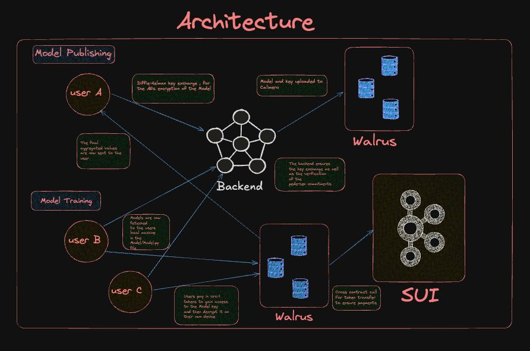

# Sui-FL

Sui-FL is a platform designed to enable secure and privacy-preserving model training across distributed datasets, where data providers can share encrypted datasets for AI model training. Sui Smart contacts serve as a backbone for aggregation and AI operations, while Walrus is the storage solution for distributed weights.

## System Overview

The platform consists of three main layers: user interaction, distributed backend processing, and dual storage infrastructure. Users interact with a distributed backend network that coordinates AI model operations across blockchain and decentralized storage systems.

## Core Components

### Users
The system supports multiple user types with different capabilities:
- **User A**: Handles model validation and fleet management, ensuring locked models don't interfere with fine-tuned computations
- **User B**: Focuses on blockchain integration, computing AI models directly to the SUI blockchain
- **User C**: Manages training epochs and model improvements, sending optimization data to enhance SUI models

### Backend Network
The distributed backend serves as the central coordination layer, managing connections between users and storage systems. It sources key elements through validation calls from different user connections and orchestrates model operations across the infrastructure.

### Storage Infrastructure

#### SUI Blockchain
SUI blockchain handles the on-chain aspects of the system, including model results storage, cross-chain token transfers for payments, and ensuring transparent transactions. All computational results are recorded on-chain for verifiability.

#### Walrus Storage
Walrus provides decentralized storage for model data and training materials. The system uses multiple Walrus instances to separate different types of data and ensure redundancy.

### Model Operations

#### Model Publishing
The publishing pipeline takes trained models and makes them available through the Walrus storage network. Published models are linked to their blockchain records for full traceability.

#### Model Training
The training system processes user-submitted epochs and training data, utilizing Walrus storage for data persistence and computational resources.

## Data Flow

1. **User Interaction**: Users submit validation requests, training epochs, or model computation tasks to the backend network
2. **Backend Processing**: The distributed backend coordinates requests and routes them to appropriate storage systems
3. **Storage Operations**: Model data is stored in Walrus while results and transactions are recorded on SUI blockchain
4. **Result Distribution**: Computed results and payments flow back to users through the SUI blockchain

## Key Features

- **Decentralized Architecture**: No single point of failure with distributed backend and storage
- **Blockchain Integration**: Transparent operations and payments through SUI blockchain
- **Scalable Storage**: Walrus decentralized storage handles large model files and training data
- **Multi-User Support**: Different user types with specialized capabilities and access patterns
- **Model Lifecycle Management**: Complete pipeline from training through publishing and validation

