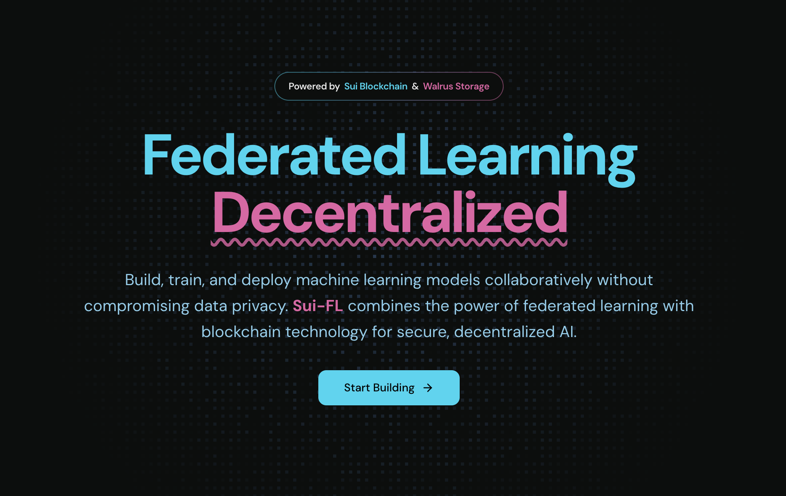
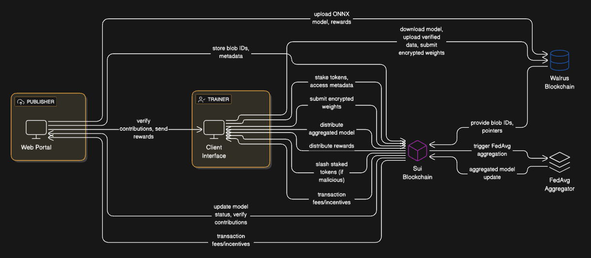

# Sui-FL

Sui-FL is a platform designed to enable secure and privacy-preserving model training across distributed datasets, where data providers can share encrypted datasets for AI model training. Sui Smart contacts serve as a backbone for aggregation and AI operations, while Walrus is the storage solution for model data.

# System Overview

## Components

### 1. Users
- **Publisher**: Initiates a federated learning job by uploading a model (in .onnx format) and specifying a reward for contributors.
- **Trainer**: Participates in training by contributing compute and data locally, receiving rewards for valid updates.

### 2. Walrus Blockchain
* Decentralized storage layer.
* Stores the actual model files, training data, encrypted weight updates, and any associated blobs.

### 3. Sui Blockchain
- Coordination and state management layer.
- Tracks model metadata (e.g., blob IDs, training status).
- Handles staking, reward distribution, trainer slashing, and federated aggregation logic via smart contracts.

### 4. Aggregator (on Sui)
- Federated averaging module.
- Triggered when enough updates are submitted.
- Computes the global model weights from encrypted updates using privacy-preserving aggregation on the Sui chain.

## Flow
### 1.	Model Publishing
The publisher uploads a machine learning model in ONNX format along with a reward incentive. The model file is stored on Walrus, while the associated metadata (blob ID, model state) is stored on the Sui chain.
### 2.	Trainer Participation
Trainers register by uploading input data that meets a predefined format. They locally train the model and compute updated weights and biases. Before submitting, the weights are encrypted using Pedersen commitments to preserve privacy. Trainers must stake tokens defined by the publisher to discourage malicious behavior.
### 3.	Update Submission
Encrypted model updates are uploaded to Walrus, and corresponding metadata (stake, trainer address, proof of work) is recorded on the Sui chain.
### 4.	Aggregation Trigger
When a sufficient number of trainer updates are recorded, the publisher can initiate a federated averaging round. The Aggregator module on Sui collects the encrypted updates and computes the new global model parameters.
### 5.	Model Finalization
The final aggregated model is committed to Walrus, and its reference is stored on Sui. Trainers who submitted valid updates are rewarded automatically through smart contract execution.

## Privacy and Security
- Pedersen Commitments are used to encrypt weight updates, ensuring that training data and local gradients remain private.
- Staking and Slashing ensure that malicious trainers can be economically penalized.
- Decentralized Storage ensures high availability and tamper resistance for models and updates.

## Why Sui??
We chose Sui for its powerful and intuitive approach to blockchain architecture. At its core, Sui handles all our components - from models to rewards - as distinct objects on the chain, giving us precise control over their states and history. 

This design allows multiple trainers to work simultaneously without slowing down the network. 

Security is a top priority: Sui's built-in ownership system makes sure only authorized trainers and publishers can access and modify their respective assets. The platform runs on Move, a programming language specifically designed for blockchain, which helps us build reliable smart contracts for coordinating the training process and managing rewards. 

To keep things cost-effective, we only store essential metadata on Sui while keeping the larger files on Walrus. Perhaps most importantly, all the critical operations - from verifying trainers to triggering model updates - happen automatically and transparently on the blockchain, eliminating the need for trust between participants.
